# Performance test of HVPA to scale a Kubernetes Cluster to >220 nodes
## Description

A round of HVPA test was triggered with HPA and VPA on kube-apiserver (via HVPA) and VPA on ETCD (via HVPA) and VPA for the rest of the control-plane components.

## Contents
* [Performance test of HVPA to scale a Kubernetes Cluster to &gt;220 nodes](#performance-test-of-hvpa-to-scale-a-kubernetes-cluster-to-220-nodes)
   * [Description](#description)
   * [Contents](#contents)
   * [Infra Setup:](#infra-setup)
   * [Limits and Requests of All Control Plane Components](#limits-and-requests-of-all-control-plane-components)
   * [Test Workload Regime](#test-workload-regime)
      * [Actual workload (configmaps, secrets, pods)](#actual-workload-configmaps-secrets-pods)
      * [Non-workload](#non-workload)
         * [Namespaces, Services, ServiceAccounts](#namespaces-services-serviceaccounts)
         * [Nodes, Leases and Calico resources](#nodes-leases-and-calico-resources)
         * [Events](#events)
         * [Everything else](#everything-else)
   * [Analysis](#analysis)
      * [Summary / Highlights](#summary--highlights)
      * [Detailed Analysis](#detailed-analysis)
         * [Cluster Scaling](#cluster-scaling)
            * [Pod scheduling](#pod-scheduling)
            * [Total API request rate](#total-api-request-rate)
               * [GET request rate](#get-request-rate)
               * [LIST request rate](#list-request-rate)
               * [PATCH request rate](#patch-request-rate)
               * [POST request rate](#post-request-rate)
               * [PUT request rate](#put-request-rate)
               * [WATCH request rate](#watch-request-rate)
            * [Registered Watchers](#registered-watchers)
         * [Resource usage by component](#resource-usage-by-component)
            * [kube-apiserver](#kube-apiserver)
               * [Horizontal scaling](#horizontal-scaling)
               * [Vertical scaling](#vertical-scaling)
               * [API request rate vs. kube-apiserver scale](#api-request-rate-vs-kube-apiserver-scale)
            * [etcd-main](#etcd-main)
               * [Overview](#overview)
               * [Vertical scaling](#vertical-scaling-1)
               * [API request rate vs. etcd-main request rate vs etcd-main scale](#api-request-rate-vs-etcd-main-request-rate-vs-etcd-main-scale)
            * [etcd-events](#etcd-events)
               * [Overview](#overview-1)
               * [Vertical scaling](#vertical-scaling-2)
               * [API request rate vs. etcd-events request rate vs etcd-events scale](#api-request-rate-vs-etcd-events-request-rate-vs-etcd-events-scale)
            * [kube-controller-manager](#kube-controller-manager)
               * [API request rate vs. kube-controller-manager scale](#api-request-rate-vs-kube-controller-manager-scale)
            * [cloud-controller-manager](#cloud-controller-manager)
            * [kube-scheduler](#kube-scheduler)
               * [API request rate vs. kube-scheduler scale](#api-request-rate-vs-kube-scheduler-scale)
            * [machine-controller-manager](#machine-controller-manager)
            * [cluster-autoscaler](#cluster-autoscaler)
               * [API request rate vs. nodes vs. cluster-autoscaler scale](#api-request-rate-vs-nodes-vs-cluster-autoscaler-scale)
            * [prometheus](#prometheus)
         * [API Server Connectivity](#api-server-connectivity)
            * [Connectivity during control-plane scaling](#connectivity-during-control-plane-scaling)
            * [etcd-main scaling](#etcd-main-scaling)
            * [kube-apiserver scaling](#kube-apiserver-scaling)
         * [API Request Latency](#api-request-latency)
            * [API request rate vs. latency](#api-request-rate-vs-latency)
            * [API request latency vs. etcd-main request latency](#api-request-latency-vs-etcd-main-request-latency)
            * [etcd-main request rate vs. latency vs. kube-apiserver scaling](#etcd-main-request-rate-vs-latency-vs-kube-apiserver-scaling)
   * [Events :](#events-)
      * [Observations:](#observations)

## Infra Setup:
1. The setup was based on the following PRs
   * [WIP] Integrating hvpa-controller into Gardener -> https://github.com/gardener/gardener/pull/1421
   * Update policy for HVPA -> https://github.com/gardener/hvpa-controller/issues/13
   * Streamline status of HVPA -> https://github.com/gardener/hvpa-controller/issues/14
   * Two-level metrics for HVPA -> https://github.com/gardener/hvpa-controller/issues/15

1. Initial worker node : 10
1. Node type : n1-standard-1 (1c CPU, 3.75Gi Mem)
1. Maximum nodes it can reach : 500.
1. The control-plane was hosted as workload in another dedicated Kubernetes cluster (the seed cluster).
1. ETCD:          
     * VPA via HVPA with update mode `ScaleUp`
       * MinChange
         * CPU: 1
         * Memory: 2G
         * Stabilization Duration: 5m
       * VPA Recommender ETCD starting Target: 300mc, 1.049gb
       * Initial ETCD-Main Reqs: 500mc, 1.049mb
     * HPA `Off`
     * Limits
       * CPU: 4c   
       * Mem: 30GB
1. Apiserver:  
     * HPA via HVPA with update mode `Auto`
       * MaxReplicas: 4
     * VPA via HVPA with update mode `ScaleUp`
       * MinChange
         * CPU: 300m
         * Memory: 200M
       * Stabilization Duration: 3m
       * VPA Recommender Apiserver starting Target: 400mc, 400mb
     * Limits
       * CPU:  8c    
       * Mem: 25G
1. Pod Configuration: busybox with one configmap and secret (each of 1kb) created and mounted for each pod. Each pod has a liveness and readiness probe.
1. Reconciliation Enabled on the shoot

 
## Limits and Requests of All Control Plane Components

```sh
Name                          Limits
cloud-controller-manager     map[cpu:500m memory:512Mi]
cluster-autoscaler           map[cpu:1 memory:3000Mi]
dependency-watchdog          map[cpu:50m memory:128Mi]
gardener-resource-manager    map[cpu:400m memory:512Mi]
grafana-operators            map[cpu:200m memory:128Mi]
grafana-users                map[cpu:200m memory:128Mi]
kube-apiserver               map[cpu:10 memory:30G],map[cpu:1k memory:2G],map[cpu:1 memory:2000Mi]
kube-controller-manager      map[cpu:1500m memory:1500Mi]
kube-scheduler               map[cpu:1500m memory:1500Mi]
kube-state-metrics           <none>
kube-state-metrics-seed      <none>
machine-controller-manager   map[cpu:3 memory:3000Mi]

Name           Limits
etcd-events   map[cpu:2500m memory:20Gi],map[cpu:1 memory:10G]
etcd-main     map[cpu:4 memory:30G],map[cpu:1 memory:10G]
prometheus    map[cpu:300m memory:512Mi],map[cpu:50m memory:128Mi],map[cpu:10m memory:20Mi]
```   

## Test Workload Regime

### Actual workload (configmaps, secrets, pods)

The following resources were actively created as the test workload.
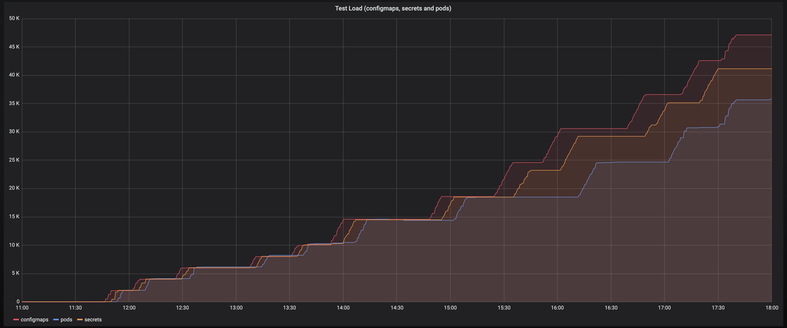

### Non-workload

The following resources were not part of the active workload. They were either setup as pre-requisites or were created/managed by Kubernetes to serve the active workload.

#### Namespaces, Services, ServiceAccounts

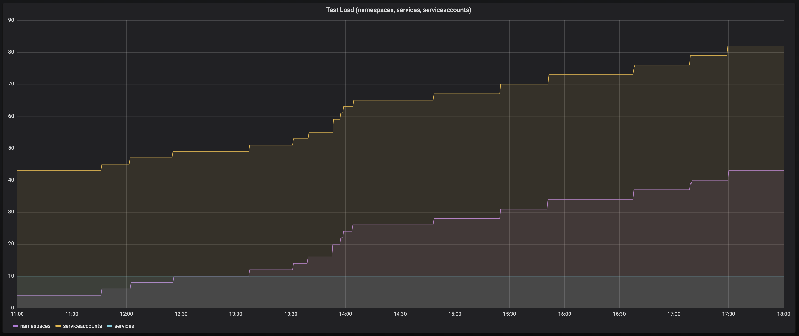
These were created as part of the setup.

#### Nodes, Leases and Calico resources

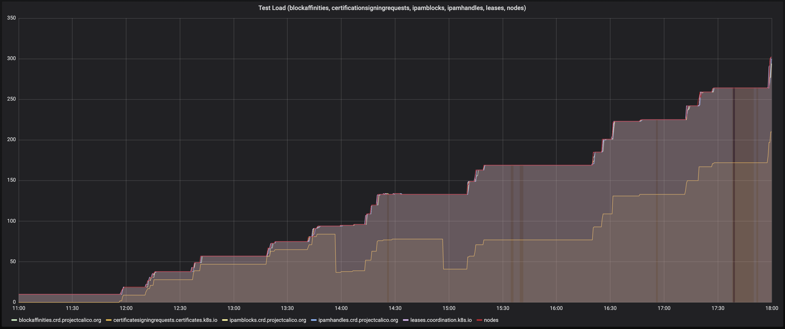
Nodes were created by the `cluster-autoscaler` based on the number of unschedulable pods. The other resources such as `leases` and Calico resources are closely linked with `nodes`.

#### Events

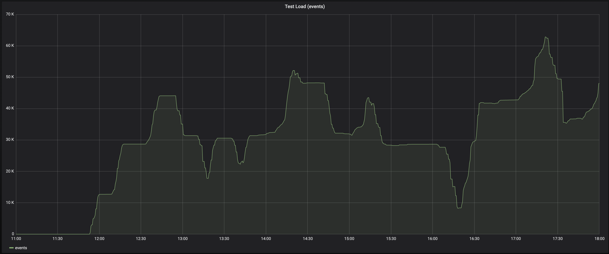
Events are generated by various Kubernetes components asynchronously and are not critical for performance.

#### Everything else

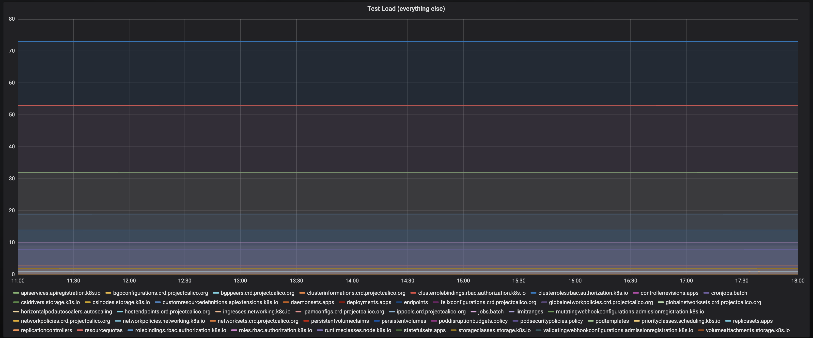
Everything else was constant throughout the test run.

## Analysis

### Summary / Highlights

* Scaling
   * The cluster [scaled](#cluster-scaling) well in response to the workload till the scale of 240 nodes. The control-plane became unstable after that.
      * VPA needs to be enabled for [`cluster-autocaler`](#cluster-autoscaler).
   * Almost all components [scaled](#resource-usage-by-component) in proportion to the workload. The correlation between the API request rate and the scale of the various components can be found below.
      * [API request rate vs. kube-apiserver scale](#api-request-rate-vs-kube-apiserver-scale)
      * [API request rate vs. etcd-main request rate vs etcd-main scale](#api-request-rate-vs-etcd-main-request-rate-vs-etcd-main-scale)
      * [API request rate vs. etcd-events request rate vs etcd-events scale](#api-request-rate-vs-etcd-events-request-rate-vs-etcd-events-scale)
      * [API request rate vs. kube-controller-manager scale](#api-request-rate-vs-kube-controller-manager-scale)
      * [cloud-controller-manager](#cloud-controller-manager)
      * [API request rate vs. kube-scheduler scale](#api-request-rate-vs-kube-scheduler-scale)
      * [machine-controller-manager](#machine-controller-manager)
      * [API request rate vs. nodes vs. cluster-autoscaler scale](#api-request-rate-vs-nodes-vs-cluster-autoscaler-scale)
      * [prometheus](#prometheus)
  * Steps to recover the control-plane from the catastrophic failure
    * After scaling kube-apiserver to 10 CPU and 6 replicas the control-plane and the cluster became healthy by itself.
    * With etcd scaled to 30G, it could support 8 kube-apiserver replicas of 15G.
* API Server Connectivity
  * The connectivity to `kube-apiserver` was predictably disrupted because of [`etcd-main` scaling](#etcd-main-scaling).
  * The connectivity was not noticeably disrupted because of [`kube-apiserver` scaling](#kube-apiserver-scaling).
* Request Latency
  * `etcd-main` request latency strongly correlated with [`kube-apiserver` rolling updates](#etcd-main-request-rate-vs-latency-vs-kube-apiserver-scaling). 

### Detailed Analysis

#### Cluster Scaling

##### Pod scheduling

Scaling continued without major disruption until ~240 nodes at 17:10 and then scaling of `kube-apiserver` and `etcd` started becoming disruptive.


The lag between total number of `pods` vs. running `pods` is completely explained by the total number of `nodes`.

The `pods` per `Node` ratio is ~110 which was the `kubelet` configuration.

##### Total API request rate

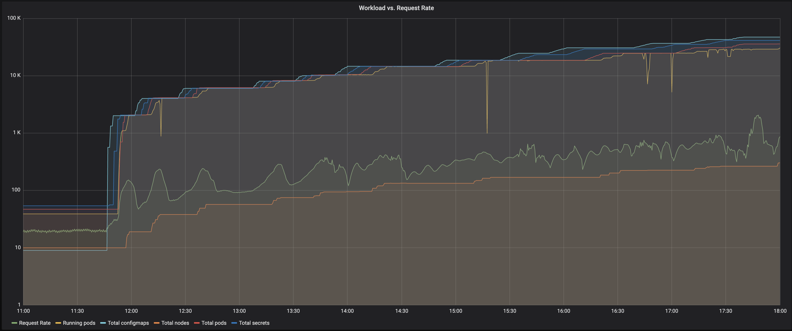
Overall, the request rate scaled in correlation to the workload. The spikes in request rate are correlated with bursts in the workload.

###### GET request rate

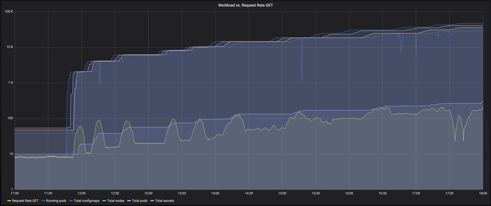
GET requests follow the same trend as the overall requests. The impact of bursts in workload is even more prominent.

###### LIST request rate


LIST requests follow the same trend as the overall requests. The impact of bursts in workload is not so prominent.

###### PATCH request rate

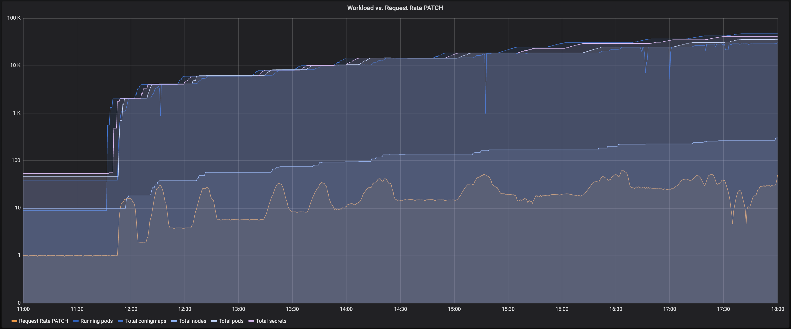
PATCH requests follow the same trend as the overall requests. The impact of bursts in workload is even more prominent.

###### POST request rate


POST requests deviated from the trend of the overall requests. There was less correlation with the workload. But the impact of bursts in workload was even more prominent.

###### PUT request rate

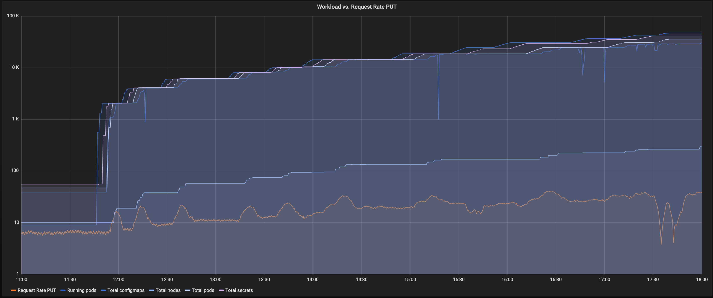
PUT requests deviated from the trend of the overall requests. There was less correlation with the workload.

###### WATCH request rate

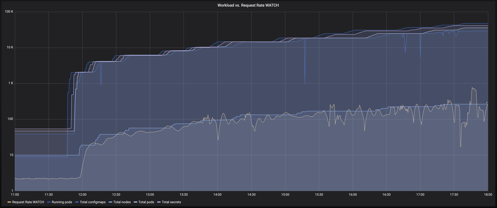
WATCH requests follow the same trend as the overall requests. However, the impact of bursts in workload is almost non-existent.

##### Registered Watchers

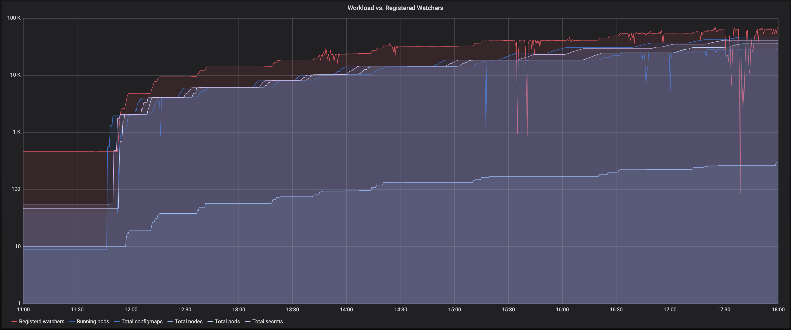
Registered watchers scaled in correlation with the workload. This is probably linked more to the `configmaps` and `secrets` than the `pods` due to the default watch policy of `kubelet`.

#### Resource usage by component


The above graph shows a comparison of resource usage (CPU and memory) by containers. The comparison if container to container by maximum of the resource usage by any of the replicas of that component.

The top three containers by resource usage are `kube-apiserver`, `prometheus` and `etcd` in that order (for both CPU and memory).

##### kube-apiserver

###### Horizontal scaling


The horizontal scaling of `kube-apiserver` was manged by HVPA with more `Auto`. I.e. HVPA allowed HPA to scale till `maxReplicas` were reached and only then started vertical scaling.

Initially, all the scaling is horizontal until it is scaled to 4 replicas around 12:15. All the rest of the scaling is vertical.

###### Vertical scaling


As can be seen above, there were multiple vertical scalings of `kube-apiserver` after 12:15 almost all of which were non-disruptive until 17:10.

###### API request rate vs. kube-apiserver scale

The following graph shows overall API request rate vs. aggregated (across all replicas) actual CPU and memory usage by `kube-apiserver`.
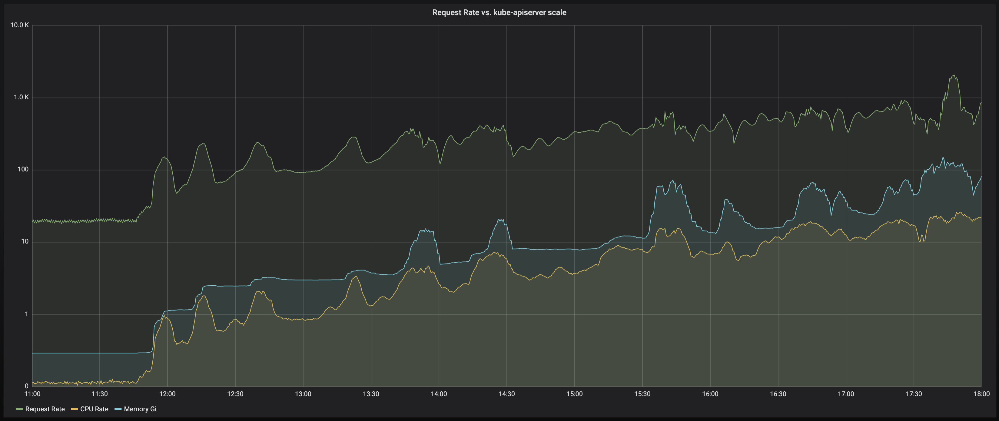

##### etcd-main

###### Overview

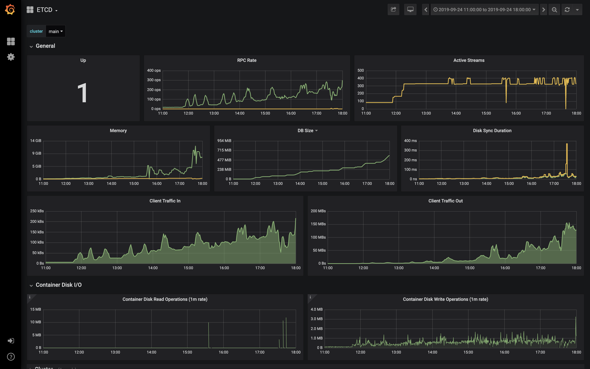

###### Vertical scaling


As can be seen above, `etcd-main` was memory-bound.

The vertical scaling of `etcd` was controlled via HVPA.

There were back-to-back scaling around 15:43 and 15:39 stabilized by the scale-up stabilization duration. Both these scaling caused a disruption of <90s. Later scaling after 17:10 with >240 nodes caused longer and more uncontrolled disruptions.

###### API request rate vs. etcd-main request rate vs etcd-main scale

There was only one replica used for `etcd-main`.
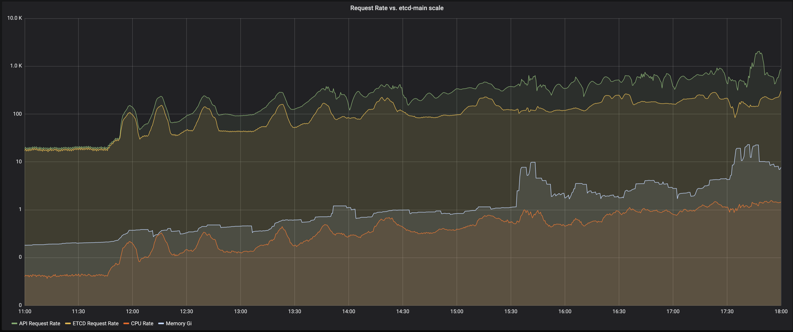

##### etcd-events

###### Overview

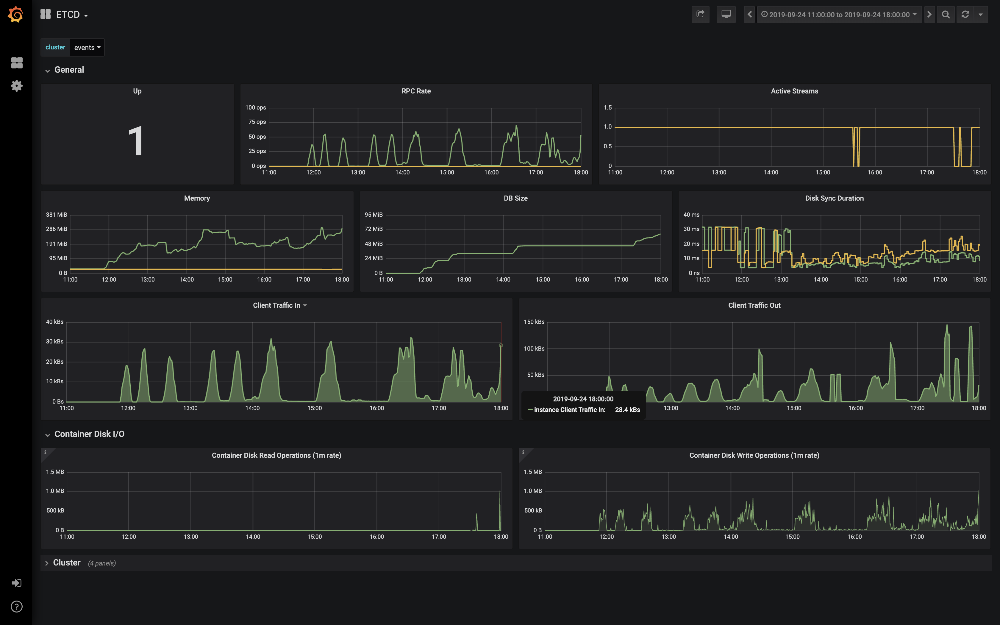

###### Vertical scaling


There was no scaling required for `etcd-events`.

###### API request rate vs. etcd-events request rate vs etcd-events scale

There was only one replica used for `etcd-events`.
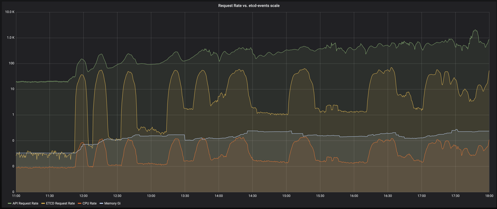

##### kube-controller-manager


Scaling of `kube-controller-manager` was not required because of the very high resources allocated to it initially.
Unsure from where such high resource requests were set.

###### API request rate vs. kube-controller-manager scale

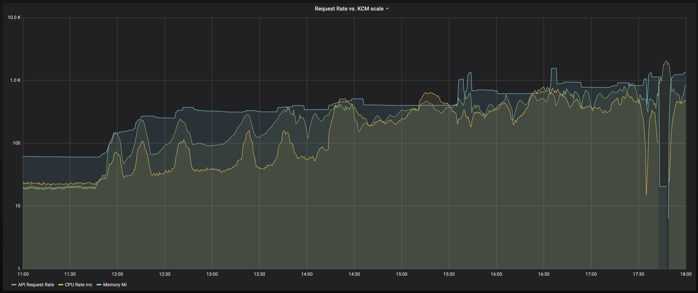

##### cloud-controller-manager


`cloud-controller-manager` was unaffected by the workload. The workload was not designed to load `cloud-controller-manager`.

##### kube-scheduler


`kube-scheduler` was directly scaled by VPA in `Auto` mode.
The CPU usage was directly related to the burst of new pods to be scheduler whereas memory usage was proportional to the number of pods.

###### API request rate vs. kube-scheduler scale

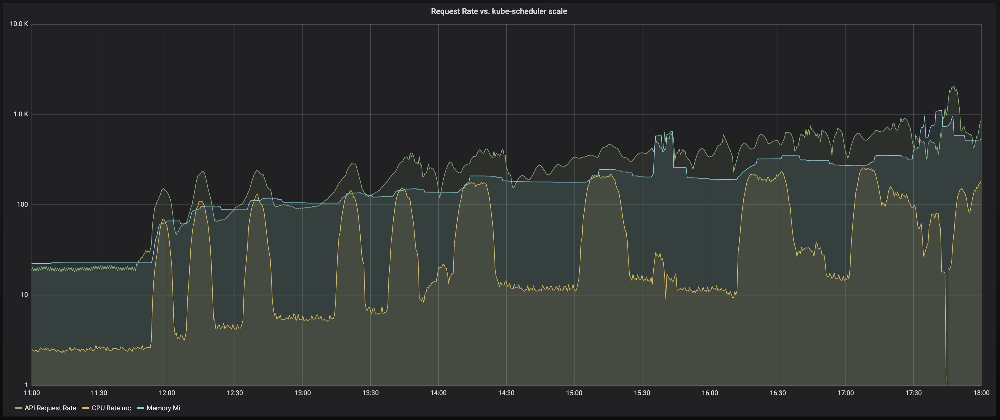

##### machine-controller-manager


`machine-controller-manager` seems to be CPU-bound. But the scaling seems to be sub-linear. However, there seems to be some scope for optimization here.

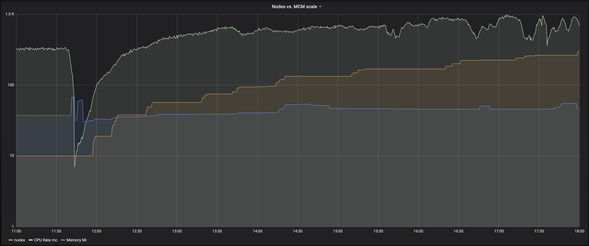
The correlation between the `machine-controller-manager` scale and `nodes` is unclear.

##### cluster-autoscaler


VPA was not enabled for `cluster-autoscaler`. Based on the resource usage shown above, it seems to be mainly memory-bound but also to a lesser extent CPU-bound. So, it makes sense to enable VPA for `cluster-autoscaler`.

###### API request rate vs. nodes vs. cluster-autoscaler scale

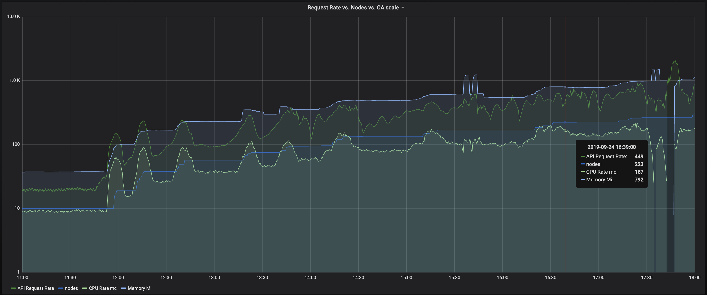
The CPU usage seems to scale with the API request rate (mainly, pods) and the memory usage seems to scale with the total number of `nodes`.

##### prometheus


#### API Server Connectivity

##### Connectivity during control-plane scaling


Scaling continued without major disruption until ~240 nodes at 17:10 and then scaling of `kube-apiserver` and `etcd` started becoming disruptive.

##### etcd-main scaling

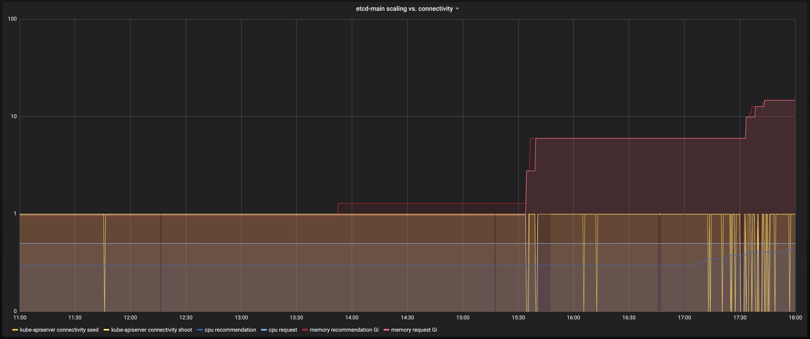

There is direct correlation between `etcd-main` scaling and disruption to `kube-apiserver` connectivity. This is because of `etcd-main` is a single replica. The disruption (as well as the correlation with scaling) is <90s before the cluster crosses the 240 nodes scale. The diruptions and their causes become more unpredictable beyond that scale.

##### kube-apiserver scaling


`kube-apiserver` scaling is not directly correlated with a disruption to the connectivity. 
There are a couple of disruptions reported between 16:00 and 16:30 but these are not correlated with any scaling or disruptions to the number of replicas of `kube-apiserver`. Also, these disruptions are only reported form the shoot side and the seed side report is healthy.

#### API Request Latency

##### API request rate vs. latency

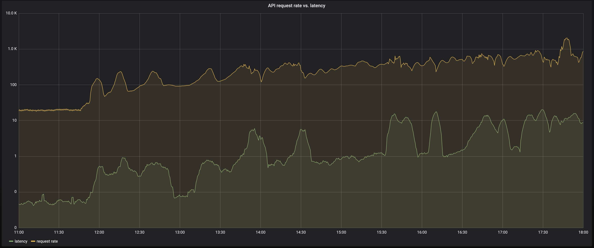

##### API request latency vs. etcd-main request latency


##### etcd-main request rate vs. latency vs. kube-apiserver scaling

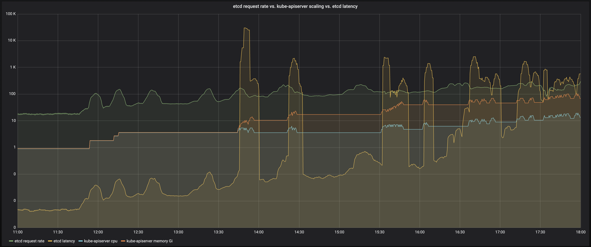
The `etcd-main` request latency seems to overall correlate with the request rate. But the correlation is much stronger with `kube-apiserver` rolling updates (or container restarts, in general). This is because of an increase in `GET` and `LIST` calls during `kube-apiserver` container start up.

## Events :
**Following events occurred during 7hrs of test execution**
```
1. During scale up of 10nodes, KCM new pod came up
     CPU: changed from 120mc->2c
     Mem : 128mb->14.81gb
     Even though target values didn’t change
     Target : (35mc, 78mb); Usage: (22mc,70mb)
     Changed the values to lower nos but GCM reconciled it back to higher values
     Continuing tests with KCM higher limits
2. VPA updater has erros- E0924 04:14:56.917530  1 reflector.go:126] k8s.io/client-go/informers/factory.go:133: Failed to list *v1.LimitRange:  limitranges is forbidden: User "system:serviceaccount:garden:vpa-updater" cannot list resource "limitranges" in API group "" at the cluster scope </br>
     a. Cannot run test with lastest VPA, so have to revert it back to 0.5.0 </br>
     b. MCM limits should be changed to higher values
    "gcp-machine-controller-manager {\"limits\":{\"cpu\":\"3\",\"memory\":\"3000Mi\"},\"requests\": {\"cpu\":\"50m\",\"memory\":\"64Mi\"}}
3. At 1000pods HPA happened
      1pods->2pods
4. At 28th nodes another HPA happened
      2pods-> 3pods
5. At 37th node HPA
      3pods->4pods
*** No VPAs till here ***
*** Reason for no VPA- VPA weight wasn't changed to 0 & 100 but had older values 0 &1 ***
6. At 90th node VPA on apiserver
      VPA on Mem: 839mb->1.55gb
7. At 94th node VPA on apiserver
      VPA on mem: 1.55gb->1.837gb
      VPA on Mem: 1.837gb->2.68GB
8. At 126th node VPA on apiserver
      VPA on mem: 2.68gb->2.976gb
9. At 132th node VPA on apiserver
      VPA on mem: 2.976gb->4.507gb
10. At 170th node VPA on apiserver
      VPA on CPU: 800mc->1.10k
      VPA on Mem: 4.5gb->4.99gb
      VPA on Mem: 4.99gb->6.43gb
11. At 170th node VPA on etcd
      VPA on Mem: 1.049gb->2.976gb (time 15:34pm)
      VPA on Mem: 2.976gb->6.435gb(time 15:39pm)
12. At 170th node VPA on apisever
      VPA on mem: 6.43gb->6.77g, time 15:40
      VPA on mem: 6.77gb->10.63gb, time: 15:43:30
13. At 170th node VPA on apiserver
      VPA on CPU: 1.10c->1.47c , time: 16:03:15
14. At 223th node VPA on apiserver
      VPA on CPU: 1.47c->1.8c
      VPA on Mem: 10.63gb->11.17gb
15. At 225th node VPA on apiserver
      VPA on mem: 11.17gb->12.34gb, time: 16:45:30
      VPA on CPU: 1.8c->2.16c, time: 16:52:00
16. At 240th node VPA on apiserver
      VPA on CPU: 2.16c->2.54c, time: 17:13
*** apiserver connectivity is 0***
17. At 260th node VPA on apiserver
      VPA on Mem: 12.34gb->12.97gb
*** CPC went into CrashLoopBackOff***
18. At 264th Node VPA on Apiserver
      VPA on Mem: 12.97gb->13.63gb, time: 17:32
      VPA on Mem: 13.63gb->15.81gb->17.45gb->18.34gb,  time: 17:50:15
      VPA on CPU: 2.54c->2.98c
```

### Observations:

1. After 264node All the control Plane components failing, status- CrashloopBackoff
Error: Liveness probe failed
1. Cluster Status Nodes=264 Pods=35k Total; Pending Pods=6608
Configmpas=47215; Secrets=41229
1. Thrice KCM pod was created with new reqs, with following changes-
CPU 120mc->2c, 2c->109mc at 17:37 pm
Mem : 128mb->14.81gb, 14.81gb->1.17gb at 17:37pm

